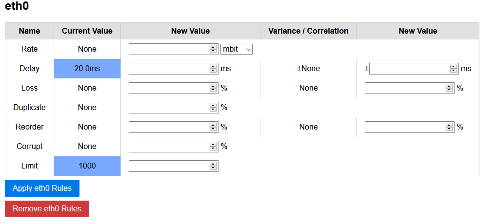

# tcgui

[](https://github.com/tum-lkn/tcgui)
[](https://github.com/psf/black)

A lightweight Python-based Web-GUI for Linux traffic control (`tc`) to set, view and delete traffic shaping rules. The Web-GUI is intended for short-term isolated testbeds or classroom scenarios and does not contain any security mechanisms.



## Requirements

- Tested with Ubuntu 16.04 LTS & Ubuntu 18.04 LTS & Raspbian 4.14.98-v7+ (stretch, Debian 9.8)
- `netem` tools & `python3-flask` are required
  - Ubuntu 16.04 : Install with `sudo apt install iproute python3-flask`
  - Ubuntu 18.04 : Install with `sudo apt install iproute2 python3-flask`
  - Ubuntu 20.04 : Install with `sudo apt install iproute2 python3-flask`
- More information:
  - [network_emulation_loss](https://calomel.org/network_loss_emulation.html)
  - [netem](https://wiki.linuxfoundation.org/networking/netem)

## Usage

Execute the main.py file and go to [http://localhost:5000](http://localhost:5000):

```shell
sudo python3 main.py

--ip IP               The IP where the server is listening
--port PORT           The port where the server is listening
--dev [DEV [DEV ...]] The interfaces to restrict to
--regex REGEX         A regex to match interfaces
--debug               Run Flask in debug mode
```

The tool will read your interfaces and the current setup every time the site is reloaded

## Docker

You can use docker to run this application. Run with host network (`--network host`) and network admin capabilities (`--cap-add=NET_ADMIN`). Site will be available on default port Ex: `http://dockerhost:5000`

```shell
docker run -dit --restart unless-stopped --network host --cap-add=NET_ADMIN ncareau/tcgui:latest
```

You can change the configuration using these Environment Variables:

- **TCGUI_IP** - *Default `0.0.0.0`* - Use to change listening address
- **TCGUI_PORT** - *Default `5000`* - Use to change the listening port
- **TCGUI_DEV** - The interfaces to restrict to
- **TCGUI_REGEX** - A regex to match interfaces

If using an interface bridge, docker might cause issue with the bridge. ([askubunut](https://askubuntu.com/questions/1073501/docker-breaks-network-bridging-to-virtual-machines))
To fix this, create a file `/etc/docker/daemon.json` with the following contents:

```json
{
    "iptables" : false
}
```

## Test & Develop

You can use the supplied Vagrantfile to test tcgui quickly. Vagrant will setup two machines, sender (192.168.210.2) and a receiver (192.168.210.3):

```shell
vagrant up
```

Afterwards connect to the sender and start the GUI:

```shell
vagrant ssh sender
cd /vagrant
sudo python3 main.py --ip 0.0.0.0 --debug
```

Start a receiver in the receiving VM:

```shell
vagrant ssh receiver
iperf3 -s
```

Send a packet stream from the sender to the receiver:

```shell
vagrant ssh sender
iperf3 -c 192.168.210.3 -t 300
```

Now access the GUI at [http://192.168.210.2:5000/](http://192.168.210.2:5000/) and change the rate of interface eth1. You should see the sending/receiving rate to decrease to the set amount.
